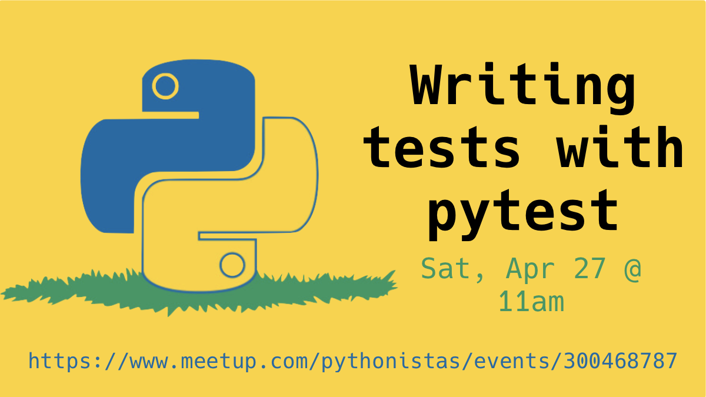
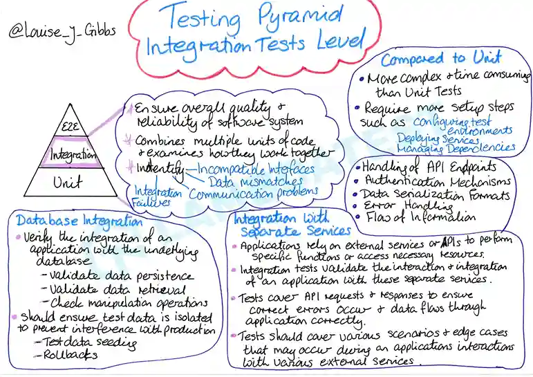
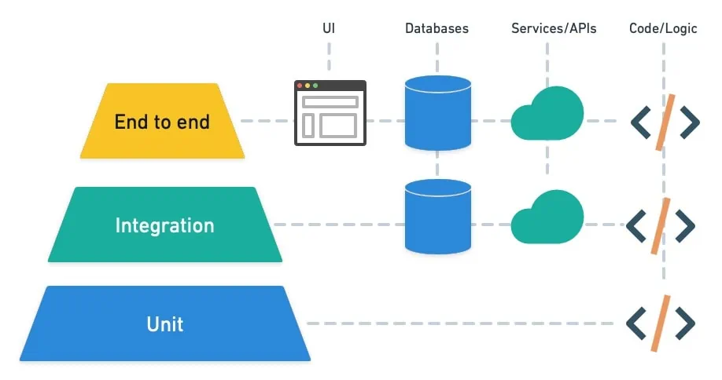

footer: Writing tests with pytest @ Pythonistas
slidenumbers: true

<!-- # How to write tests with pytest -->

<!--  -->


---

## `whoami`

Lance Stephens

* [DevOps Engineer](https://www.linkedin.com/in/lancestephens/)
* Pretty okay Pythonista 🐍
* Extracurriculars include:
  * Community organizing with [Pythonistas](https://www.meetup.com/pythonistas/) (founder) and [Coffee & Code](https://www.meetup.com/okccoffeeandcode/)
  * Going to concerts
  * Travel


^ John Muir once said that Mount Rainier was “the most luxuriant and most extravagantly beautiful of all the alpine gardens I ever beheld in all my mountain-top ramblings.”

^ https://www.treehugger.com/mount-rainier-national-park-facts-5213246

^ https://www.nps.gov/articles/john-muir-and-his-efforts-to-preserve-mount-rainier.htm

---

## Agenda

* What is pytest?
* Why pytest?
* Overview
* Kinds of tests
* Demo
* Q&A (~10 minutes)

^ Zoom basic tells me I have 40 minutes (I'll try to keep it to 30 minutes for the remote folks)

---

## What is pytest?

> The pytest framework makes it easy to write small, readable tests, and can scale to support complex functional testing for applications and libraries.

---

### Features

* Detailed info on failing assert statements (no need to remember `self.assert*` names)
* Auto-discovery of test modules and functions
* Modular fixtures for managing small or parametrized long-lived test resources
* Can run unittest (including trial) test suites out of the box
* Rich plugin architecture, with over 1300+ external plugins

---

## Why pytest?

* It's _very_ easy to get started
  * Barrier to entry is low compared to vanilla `unittest`
  * Supports unit tests, integration tests, and end-to-end (E2E) tests
* There's a _lot_ of community support (11K+ stars on [GitHub](https://github.com/pytest-dev/pytest))
* Official [Playwright plugin](https://playwright.dev/python/docs/intro) for integration and E2E testing

---

## Wildly detailed overview by somebody else

### (My handwriting isn't this pretty)

---



^ E2E: "Ensure overally quality & reliability of software system"

^ Integration: "Combines multiple units of code & examines how they work together"

^ Unit tests TBD in two slides

---

## Dramatically less detailed overview for humans

---



---

## Unit tests

A unit is the smallest testable part of an application. In procedural programming, a unit could be an entire module, but it is more commonly an individual function or method.

[unittest](https://docs.python.org/3/library/unittest.html) is Python's built-in testing framework.

--- 

## Assert Keyword

> The assert keyword lets you test if a condition in your code returns True, if not, the program will raise an `AssertionError`.

```python
x = "welcome"

assert x != "hello", "x should be 'hello'"
```

---

[.code-highlight: none]
[.code-highlight: 1]
[.code-highlight: 3]
[.code-highlight: 5-6]
[.code-highlight: 8-10]
[.code-highlight: 12-16]
[.code-highlight: 18-19]
[.code-highlight: all]

```python
import unittest

class TestStringMethods(unittest.TestCase):

    def test_upper(self):
        self.assertEqual('foo'.upper(), 'FOO')

    def test_isupper(self):
        self.assertTrue('FOO'.isupper())
        self.assertFalse('Foo'.isupper())

    def test_split(self):
        s = 'hello world'
        self.assertEqual(s.split(), ['hello', 'world'])
        with self.assertRaises(TypeError):
            s.split(2)

if __name__ == '__main__':
    unittest.main()
```

^ unittest unit test

---

[.code-highlight: none]
[.code-highlight: 1]
[.code-highlight: 3-4]
[.code-highlight: 5-8]
[.code-highlight: 10-16]
[.code-highlight: all]

```python
import pytest

def test_upper():
    assert 'foo'.upper() == 'FOO'

def test_isupper():
    assert 'FOO'.isupper()
    assert not 'Foo'.isupper()

def test_split():
    s = 'hello world'
    assert s.split() == ['hello', 'world']
    with pytest.raises(TypeError):
        s.split(2)
```

^ pytest unit test

^ `test_split` checks that s.split fails when the separator is not a string

^ Notice that there's no entrypoint like `unittest.main()`

---

### Mocking

> In object-oriented programming, a mock object is an object that simulates the behavior of a production code object in limited ways.

---

[.code-highlight: none]
[.code-highlight: 1]
[.code-highlight: 2]
[.code-highlight: 3]
[.code-highlight: 4]
[.code-highlight: 5]
[.code-highlight: 6]
[.code-highlight: all]

```python
from unittest.mock import MagicMock

thing = ProductionClass()
thing.method = MagicMock(return_value=3)
thing.method(3, 4, 5, key='value')                      # 3
thing.method.assert_called_with(3, 4, 5, key='value')   # (5, 4, 3)     
```

^ unittest mock

---

[.code-highlight: none]
[.code-highlight: 1]
[.code-highlight: 3-4]
[.code-highlight: 5-8]
[.code-highlight: 10-11]
[.code-highlight: 12]
[.code-highlight: all]

```python
import pytest

def test_method(monkeypatch):
    thing = ProductionClass()

    def mock_method(*args, **kwargs):
        assert (args, kwargs) == ((3, 4, 5), {'key': 'value'})
        return 3

    monkeypatch.setattr(thing, 'method', mock_method)

    assert thing.method(3, 4, 5, key='value') == 3
```

^ pytest mock

---

### Fixtures

> In testing, a fixture provides a defined, reliable and consistent context for the tests. This could include environment (for example a database configured with known parameters) or content (such as a dataset).

---

[.code-highlight: none]
[.code-highlight: 1]
[.code-highlight: 3-5]
[.code-highlight: 6-8]
[.code-highlight: 10-13]
[.code-highlight: 14-17]
[.code-highlight: 18-19]
[.code-highlight: all]

```python
import pytest

class Fruit:
    def __init__(self, name):
        self.name = name

    def __eq__(self, other):
        return self.name == other.name

@pytest.fixture
def my_fruit():
    return Fruit("apple")

@pytest.fixture
def fruit_basket(my_fruit):
    return [Fruit("banana"), my_fruit]

def test_my_fruit_in_basket(my_fruit, fruit_basket):
    assert my_fruit in fruit_basket
```

---

## Integration tests

> Integration testing takes as its input modules that have been unit tested ... It occurs after unit testing and before system testing.

---

[.code-highlight: none]
[.code-highlight: 1]
[.code-highlight: 3-5]
[.code-highlight: 6-8]
[.code-highlight: 10-13]
[.code-highlight: all]

```python
import unittest

class TestBasic(unittest.TestCase):
    def setUp(self):
        self.app = App(database='fixtures/test_basic.json')

    def test_customer_count(self):
        self.assertEqual(len(self.app.customers), 100)

    def test_existence_of_customer(self):
        customer = self.app.get_customer(id=10)
        self.assertEqual(customer.name, "Org XYZ")
        self.assertEqual(customer.address, "10 Red Road, Reading")
```

^ unittest integration test

---

[.code-highlight: none]
[.code-highlight: 1]
[.code-highlight: 2-4]
[.code-highlight: 5-7]
[.code-highlight: 8-12]
[.code-highlight: 13-15]
[.code-highlight: all]

```python
class TestComplexData(unittest.TestCase):
    def setUp(self):
        self.app = App(database='fixtures/test_complex.json')

    def test_customer_count(self):
        self.assertEqual(len(self.app.customers), 10000)

    def test_existence_of_customer(self):
        customer = self.app.get_customer(id=9999)
        self.assertEqual(customer.name, u"バナナ")
        self.assertEqual(customer.address, "10 Red Road, Akihabara, Tokyo")
```

^ pytest integration test using fixtures

---

## [Demo Time](https://github.com/pythoninthegrass/pytest_demo)

^ Make a note that technically playwright is E2E testing

^ Covers code/logic -> services/APIs -> ~~DB~~ -> UI

---


---

## Q&A

---


---

## Thank you

[Techlahoma](https://www.techlahoma.org/)

[The Verge OKC](https://www.vergeokc.com/)

---

## Sources

Loosely by order of appearance

---

* [pytest: helps you write better programs — pytest documentation](https://docs.pytest.org/en/8.1.x/)
* [Integration Testing Tutorial: A Comprehensive Guide With Examples And Best Practices](https://www.lambdatest.com/learning-hub/integration-testing)
* [unittest — Unit testing framework — Python 3.12.3 documentation](https://docs.python.org/3/library/unittest.html)
* [Unit testing - Wikipedia](https://en.wikipedia.org/wiki/Unit_testing)
* [Python assert Keyword](https://www.w3schools.com/python/ref_keyword_assert.asp)

---

* [Mock object - Wikipedia](https://en.wikipedia.org/wiki/Mock_object)
* [unittest.mock — mock object library — Python 3.12.3 documentation](https://docs.python.org/3/library/unittest.mock.html)
* [About fixtures — pytest documentation](https://docs.pytest.org/en/7.1.x/explanation/fixtures.html#about-fixtures)
* [Integration testing - Wikipedia](https://en.wikipedia.org/wiki/Integration_testing)
* [Getting Started With Testing in Python – Real Python](https://realpython.com/python-testing/#testing-data-driven-applications)
* [Flask Blog](https://github.com/insomnux/flaskblog)

---

## Further Reading

* [Full pytest documentation](https://docs.pytest.org/en/8.1.x/contents.html)
* [Real Python: Python Testing](https://realpython.com/python-testing/)
* [The Testing Pyramid: How to Structure Your Test Suite - Semaphore](https://semaphoreci.com/blog/testing-pyramid)
* [Pytest Fixtures: Your Secret Weapon for Writing Powerful Tests](https://blog.devgenius.io/pytest-fixtures-your-secret-weapon-for-writing-powerful-tests-5d854a01d4a6)
* [Playwright Python](https://playwright.dev/python/docs/intro)

---
